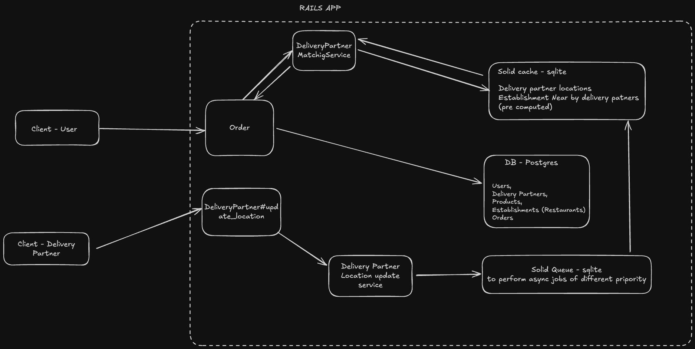

## Requirements

- postgresql@17
- rails 8
- ruby 3.4.1
- postgis (brew install postgis)


## Setup

clone the repo
install gems
```
bundle install
```
create db
```
rails db:create
```
migrations
```
rails db:migrate
```
solid cache install
```
rails solid_cache:install 
```
solid queue install
```
rails solid_queue:install
```

## System Design

